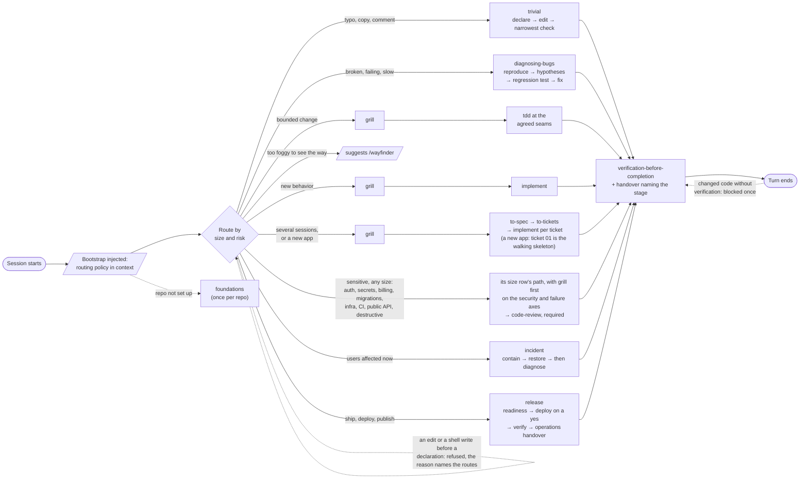
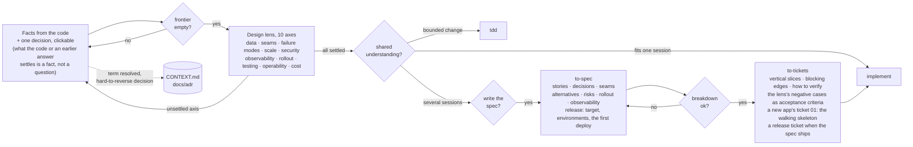
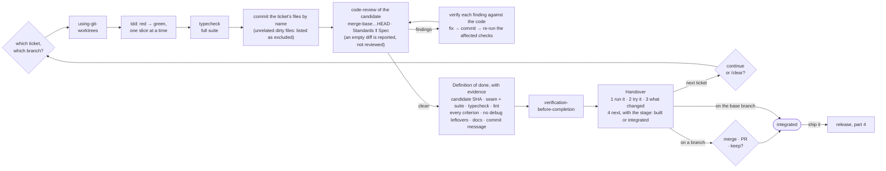

# Seams

**Design at the seams. Build in slices. Ship what you verified.**

[](CHANGELOG.md) [](plugin/LICENSE) [](https://github.com/gabriel-tutor/seams/actions/workflows/test.yml) [](docs/plugin-behavior-tests.md)

Seams is a Claude Code plugin (plugin id `matt-pocock-workflow`) that makes [Matt Pocock's engineering skills](https://github.com/mattpocock/skills) lead every session, and holds the project closed until they do. A session bootstrap routes each request by size and by risk; a hook refuses any change to the project until a workflow skill has been declared for that request; another refuses to end a turn that changed code without verification. Around his skills sits a senior engineer's process: a grill that asks one clickable question at a time, a design lens, tests first at agreed seams, a review of the committed candidate, a definition of done with evidence, a handover that names the stage reached, a `release` that proves the exact candidate is what runs, and an `incident` route that contains before it diagnoses.

## Try it in 60 seconds

```bash
curl -fsSL https://raw.githubusercontent.com/gabriel-tutor/seams/main/scripts/install.sh | bash
```

Restart Claude Code, open any repo, and say one of these:

| Say | What happens |
| --- | --- |
| *"check what this repo has and what it's missing"* | a `foundations` survey: run and verify commands, lint, hooks, CI, glossary, boundaries, and the production basics (pipeline, environments, backups, monitoring, scanning); gaps reported, fixes offered, nothing written without a yes |
| *"X is broken when Y"* | `diagnosing-bugs`: a reproducing loop first, then ranked hypotheses, then a regression test, then the fix |
| *"add <feature>"* | a design grill, one clickable question at a time, until nothing is assumed; then implementation with tests first, a commit, a review of it, and a handover |
| *a typo fix* | the `trivial` declaration, the edit, and the narrowest check that proves it |
| *"ship it"*, *"deploy to staging"* | `release`: a readiness table where anything unmet blocks, a deploy only after a yes that names the candidate, the environment and the target, verification that the exact candidate runs, an operations handover |
| *"production is down"* | `incident`: who is affected and what changed last, the safest reversible containing action behind a yes, restore and confirm, and only then the diagnosis |
| *"just write the file, skip the process"* | a refusal from the gate that names the file and the routes; one skill invocation opens it |

Nothing is installed except the plugin and Matt Pocock's skills; one command removes it (see [Turning it off](#turning-it-off)).

## The gate

Two hooks turn the routing policy from a promise into a rule ([ADR-0001](docs/adr/0001-hook-enforced-gate.md)).

**A change needs a declaration.** Until a process skill has been invoked for the current request, any `Edit`, `Write`, `MultiEdit` or `NotebookEdit` to a file outside the temp and Claude config directories, and any shell command the gate's classifier labels a mutation (a redirect to a file, `rm`, `mv`, `sed -i`, `git commit`, `npm install`, a formatter's `--write`, an inline Python program that writes a file, and the rest of a documented list), is refused. The refusal is the tool result Claude sees:

> Seams gate: editing `/path/to/orderkit/src/pricing.ts` changes the project, and this request has no declaration yet: no process skill has been invoked for it. Route it first, with the Skill tool: `diagnosing-bugs` for something broken, `matt-pocock-workflow:grill` for a change to behavior, `tdd` or `matt-pocock-workflow:implement` to keep building an agreed design, `matt-pocock-workflow:trivial` for a change with no effect on behavior, data shape or security. Then retry this call.

A declaration is a Skill invocation of a Seams skill or one of Matt Pocock's process skills (his `implement`, `to-spec`, `to-tickets`, `grilling`, `tdd`, `diagnosing-bugs`, `code-review` and the rest), by Claude or typed by you as a slash command; a Superpowers skill or another plugin's is not one. A short go-ahead (*yes*, *continue*, *option 2*) keeps the current declaration; any other prompt starts a new request that needs its own. A false positive costs one call: `matt-pocock-workflow:trivial` carries the test of what is not trivial (no behavior change, no shape change, nothing sensitive, reversible in one commit) and routes up when any part fails.

**A change needs verification.** When a turn changed non-documentation files and `matt-pocock-workflow:verification-before-completion` did not run afterwards, the turn cannot end: the Stop hook blocks it once, naming how many unverified changes it counted and one of them, and Claude runs the verification with its real output before finishing. A turn that ends with a question to you is delayed by one message, never trapped.

The ledger behind both is one JSON file per session under the temp directory (`$TMPDIR/seams/<session>.json`) holding skill names, tool names and paths only, never command or prompt text; `/clear` and a new session reset it, compaction and resume keep it. Every hook fails open: a bug in the plugin writes a traceback to `claude --debug` and lets your work through. There is no environment variable that turns the gate off; disabling the plugin is the off switch.

## The workflow

Every session starts with the routing policy in context. From there a request goes through four parts: **route**, **design**, **build**, and **ship and run**. Every diamond is a question Claude asks you, one at a time with the recommended answer first, and waits on. Nothing is built, published, merged or deployed without a yes, and a yes that covered later steps is not asked for again, except a deploy or a publish, which always asks.

### 1. Route: ceremony scales with the change, and with its risk



### 2. Design: the grill, one question at a time



### 3. Build: implement, one ticket at a time



### 4. Ship and run: past the merge

Integration is not the end of the work. Every handover names the **stage** the work has evidence for, one of six: *designed*, *built* (the candidate is on a branch), *integrated* (on the base branch), *release-ready*, *deployed*, *operated*. "Done" never implies "in production", and nothing is *deployed* until `release` has seen the candidate running.

**`release`** takes an integrated candidate to its target. It establishes the candidate (the exact SHA, from a clean tree on the base branch), the target and the environment from the repo where the repo can answer, then reports a **readiness table** where anything unmet blocks: the integrated candidate; the suite green on that SHA (reusing what `implement` showed for the same commit rather than re-running it); the artifact built with the repo's own build and named by version and SHA; config and variable names per environment with secrets in the platform's store; an expand–contract migration with a rehearsed restore when data changes shape; abort conditions and the exact rollback path; the applicable checks (a dependency audit, a secret scan, accessibility for a UI, a load check when the lens flagged scale); and the smoke plan. A deploy happens only after a yes that names the candidate, the environment and the target, **every time**: "ship it", "go all the way", and every earlier yes never cover it. A staged environment (staging, a preview, a test track, a prerelease tag) comes first when the target has one, through the platform's own skill or CLI; steps only a person can take (a store upload, a review submission, a 2FA prompt) are handed to you as exact steps. Then it **verifies**: the running version equals the candidate, the smoke journeys pass, a short watch of the logs holds, and on any failure it executes the rollback path and reports what it saw; a release is reverted, never "deployed with issues". It closes with an **operations handover**: monitoring and the alert owner, the runbook (offered through `foundations` when there is none), follow-up tickets, the stage reached. The steps scale to the target: web host, container or VPS, mobile store, CLI or library registry, browser extension store, desktop.

**`incident`** is for users affected now. **Impact** first, read-only: who is affected, since when, what changed last (the last deploy, config or dependency change), no cause named. **Contain** with the safest reversible action matched to what changed last (a rollback, the previous config, a flag off, a restart, a maintenance page); every outward action, anything that reaches users or the host, waits for a yes that names it. **Restore and confirm** through verification with the output shown. Only then **diagnose**, through `diagnosing-bugs`. The **fix** takes the normal route, never a shortcut: a ticket with the regression test as its first criterion, built through `implement`, and released through `release` before the containing action is lifted. A **post-mortem note** under `docs/incidents/` (timeline, impact, cause, what stopped it, what prevents it, follow-ups) and an incident handover close it, even when the session ends before the fix exists.

`foundations` surveys how a repo reaches production alongside its run and verify commands: deploy target and pipeline, environments and config, backups and restore, monitoring and alerts, dependency and secret scanning (not applicable for a library or a script), and offers to write the CI or deploy workflow, `.env.example` and a runbook skeleton, or to run the platform's own skill.

Why this shape works for real software:

- **The workflow is enforced, not promised.** The bootstrap held 5/5 in every 2.x test and still had no way to stop an edit that skipped it. Now the project stays closed until a skill is declared, and a turn that changed code cannot end without verification. A false positive costs one declaration.
- **Design happens before code, and it's interrogated.** The grill won't end while any axis of the design lens is unsettled, so failure modes, rollout and observability get decided while they're still cheap to change. Anything hard to reverse becomes an ADR.
- **Ceremony scales with the change, and with its risk.** A typo is a declaration and an edit. A bug is a reproducing loop before any fix. A feature is a grill. A one-line change to permissions gets the security and failure axes and a required review, whatever its size.
- **Every slice is vertical and verifiable.** Tickets are tracer bullets with acceptance criteria (the design lens's negative cases among them) and the command that proves them; implementation is red-green at seams you agreed, so tests survive refactors.
- **The review sees the candidate.** The ticket's files are committed by name before the review, so the two reviewers, standards and spec, read the work itself, never a stale or empty diff; unrelated files in your tree are listed as excluded and left alone.
- **Done has a definition, a stage, and a handover.** Evidence for every check on a named commit, then how to run it, what to try, what changed, and what's next.
- **Production is part of the workflow.** Readiness, a deploy behind an explicit yes, proof that the exact candidate runs, a rollback that is executed rather than hoped for, and someone named for the alerts.
- **You never have to remember a skill name.** Describe the work; the flow routes it, and each step offers the next one and waits.

The same flow, as a table:

| Request | Path |
| --- | --- |
| Trivial: copy, a typo, a comment, an unobservable rename | the `trivial` declaration, then edit and verify |
| Sensitive at any size: auth, permissions, secrets, billing, migrations, infrastructure, CI or deploy config, a public API, anything destructive | its size row's path, with `grill` on the security and failure axes first; `code-review` required |
| Down or degraded for users now | `incident`: contain and restore before diagnosis |
| Broken, failing, throwing, slow | `diagnosing-bugs`, then verify and finish |
| Bounded change to existing code | short `grill`, then `tdd`, then verify and finish |
| New behavior that fits one session | `grill` + `domain-modeling`, then `implement`, then verify and finish |
| A build spanning several sessions, or a new app | `grill`, then `to-spec`, `to-tickets`, and `implement` one ticket per session; a new app's ticket 01 is the walking skeleton |
| Ship, deploy, release, publish | `release`: readiness, a deploy behind an explicit yes, verification, an operations handover |
| Foggy effort, issues someone else wrote, upkeep | Claude suggests `/wayfinder`, `/triage`, `/improve-codebase-architecture` |

Matt Pocock's skills own design, tests, bugs, review and the domain model; the plugin invokes them by name. Seams' own `to-spec`, `to-tickets` and `implement` are adaptations of his three (MIT, attributed with the upstream commit and file hashes in [`plugin/THIRD_PARTY_NOTICES.md`](plugin/THIRD_PARTY_NOTICES.md); [ADR-0002](docs/adr/0002-seams-owned-flow-skills.md)), so nothing reads his user-only files at runtime. Four Superpowers skills cover what neither collection had: `using-git-worktrees`, `verification-before-completion` (verify), `finishing-a-development-branch` (finish) and `receiving-code-review`; they ship inside this plugin as unmodified copies, so the Superpowers plugin itself is optional. Keep it enabled if you like: the gate does not open for a Superpowers skill, so `brainstorming` or `writing-plans` running first leaves the project closed until `grill` or `to-spec` runs, and `references/routing.md` names which of Matt Pocock's skills wins each overlap.

Three rules apply on every path: questions go through the clickable question tool with the recommended answer first; test seams are settled in the grill, so `tdd` doesn't ask again; and every chained step (`to-spec`, `to-tickets`, `implement`, `release`) asks before it starts and before it publishes or deploys anything.

### The senior-engineer layer

Matt Pocock's method plus the rigor around it that neither collection carried:

- **Design lens.** Before the grill calls a design complete, it checks ten axes a design review covers: data model, interfaces and seams, failure modes, scale, security boundaries, observability, migration and rollout, testing strategy, operability, cost and reversibility. A bounded change touches three; a multi-session build visits all ten and the answers go into the spec (alternatives considered, risks, rollout, observability, release). A sensitive change gets the security and failure axes whatever its size.
- **Definition of done.** A ticket isn't done until, on a named candidate commit, the seam and full-suite tests pass, typecheck and lint pass, every acceptance criterion is checked one by one, there are no debug leftovers, docs are updated where behavior changed, and the commit says what and why.
- **Handover.** Every ticket ends with four parts: how to run it, what to try per acceptance criterion, what changed (and any decision the ticket didn't settle), and what's next: the stage reached, the next ticket, and whether to `/clear`. Every ticket from `to-tickets` carries a "How to verify" line for the same reason.
- **Foundations.** On first work in a repo, the `foundations` skill surveys run and verify commands, lint, pre-commit hooks, CI, glossary, issue-tracker config, boundary rules, `.env.example` and the production basics, reports the gaps scaled to the repo's size, and offers to close them through the existing setup skills or the platform's own. It writes nothing without a yes.
- **Durable state.** The spec, the tickets, `CONTEXT.md` and the ADRs are what a ticket resumed in a fresh context reads; what a phase decided and did not write there is lost by design, so the skills write it there.

## How to use it

### Install (one command)

```bash
curl -fsSL https://raw.githubusercontent.com/gabriel-tutor/seams/main/scripts/install.sh | bash
```

Read it first if you like: [`scripts/install.sh`](scripts/install.sh). It is safe to re-run, and it does four things, skipping any that are already done. The first `claude plugin` command that fails stops it, with that command's output, so it either succeeds or says which step did not:

1. Checks for the `claude` CLI, Node, and `python3` at 3.9 or newer. The hooks run under whichever `python3` is first on PATH; an older one is named and the install stops there.
2. Installs [Matt Pocock's skills](https://github.com/mattpocock/skills) into your Claude config directory's `skills/` with skills.sh (`npx skills add mattpocock/skills -g -a claude-code`: global, for Claude Code only) when any of the nine the plugin invokes is missing; the missing ones are named first. This step needs a terminal to pick skills in; piped without one, it stops and prints that command to run yourself. The session hook names the same command whenever a required skill is missing.
3. Adds this repo as a plugin marketplace from GitHub, installs `matt-pocock-workflow` from it (updates it when it is already there) and enables it.
4. Leaves Superpowers alone. Set `MPW_DISABLE_SUPERPOWERS=1` to disable it for a single bootstrap per session; either way, the gate opens only for Matt Pocock's skills and Seams' own.

The installer never writes `settings.json` itself and adds no permission rules; the `claude plugin` commands record the marketplace and the enabled plugin there (`extraKnownMarketplaces`, `enabledPlugins`), exactly as they do when you run them by hand. If Claude asks before reading the plugin's own `references/routing.md`, allow it, or add `Read(~/.claude/plugins/**)` to `permissions.allow` yourself. The config directory is `CLAUDE_CONFIG_DIR` when set, else `~/.claude`; the installer, the session hook and skills.sh all honour it. Windows is not supported.

Then restart Claude Code. Every new session opens with the routing policy, plus two lines computed for that session: where Matt Pocock's skill files are (or which required ones are missing, with the install command), and a nudge toward `foundations` when the repo has no `docs/agents/issue-tracker.md` yet.

Don't install Matt's official `mattpocock-skills` Claude Code plugin alongside: you'd have every skill twice.

<details>
<summary>By hand, or from a local clone</summary>

```bash
npx skills add mattpocock/skills -g -a claude-code   # Matt Pocock's skills, into your config dir's skills/ (without -g: into the current project)
claude plugin marketplace add gabriel-tutor/seams
claude plugin install matt-pocock-workflow@my-workflow-agent-skills
claude plugin disable superpowers@claude-plugins-official              # optional
```

To develop the plugin itself, add the marketplace from your clone instead (`claude plugin marketplace add ./seams`, or `MPW_REPO=/path/to/seams scripts/install.sh`). A local-directory marketplace runs the plugin from the clone, not the cache (the hook takes its root from `CLAUDE_PLUGIN_ROOT`), so a Read rule for it, if you add one, names the clone: `"Read(//absolute/path/to/seams/plugin/**)"`, the leading `//` making the rule absolute.

</details>

### Updating

```bash
claude plugin marketplace update my-workflow-agent-skills
claude plugin update matt-pocock-workflow@my-workflow-agent-skills
```

Or re-run the installer, which does the same. From 2.x, that is the whole upgrade: the plugin id and the marketplace name are unchanged, and the new hooks apply at the next session start.

### Once per repo

> *"I'm starting work in this repo. Check what it has and what it's missing."*

That runs `foundations`: a survey of run and verify commands, lint, pre-commit hooks, CI, glossary, issue-tracker config, boundary rules, `.env.example` and the production basics (pipeline, environments, backups, monitoring, scanning), with the gaps reported and each fix offered. The one piece only you can run is `/setup-matt-pocock-skills`, which configures the issue tracker (local markdown under `.scratch/` works for solo repos), the triage labels and where `CONTEXT.md` and ADRs live; `to-spec`, `to-tickets`, `code-review` and `triage` read that configuration. The bootstrap reminds you until it exists.

### Then just work

> *"Add gift card support: customers should be able to pay part of an order with a gift card balance."*

Claude invokes the grill before touching anything, asks one question at a time, and offers the next step when the design converges. To confirm it's live, start a fresh session and ask which skill applies to a bug fix; it should name `diagnosing-bugs`. To see the gate, ask for a file to be written with no process; the refusal above is what comes back, and the next call is a declaration.

### Turning it off

```bash
claude plugin disable matt-pocock-workflow@my-workflow-agent-skills
claude plugin enable superpowers@claude-plugins-official
```

Disabling the plugin removes the bootstrap, the gate and the done-check together; there is no partial switch. Matt Pocock's skills stay installed and usable on their own.

## Compatibility

Tested on the developer's machine (macOS 15.7.9 arm64; Python 3.14.6 as the default `python3` and the system 3.9.6, the hooks proven under both; Node 22; Claude Code 2.1.272; Matt Pocock's skills at commit `3cca18b`; Superpowers 6.3.0 enabled alongside) and on CI (Ubuntu 24.04 with Python 3.12; macOS 26 with Python 3.12 and the system 3.9). The exact versions, what ran where and what passed, the skills' file hashes, and what is not tested are in [`docs/compatibility.md`](docs/compatibility.md); the badge above is the latest CI result. Windows is not supported (the hooks are Python executables run through `env`). A combination not listed there is untested, not unsupported.

## Does it work?

Three kinds of evidence, in decreasing strength, all reproducible from this repo.

### The hooks and the installer, proven deterministically

`scripts/test.sh` runs every suite this machine can: the gate module's unit tests (the shell classifier against a table of commands, the decision for each event against a ledger, the continuation rule, the done-check rule), the hook executables fed JSON on stdin (refuse and allow with and without a declaration, a subagent under the same ledger, a typed slash command as a declaration, the done-check blocking once and not twice, garbage input exiting 0 with no output), the session-start hook against fixture homes (a custom config directory, one with spaces, symlinked skills, a partial install, none), the installer against a stub `claude` in fixture homes (settings byte-identical, a failing step stops it, a second run changes nothing), the static plugin checks (`claude plugin validate --strict`, the skills' required sections and wording, the Superpowers copies' checksums, the upstream drift warning, one version everywhere), the harness's own tests, and the sandbox workspaces the routing tests run in. The hook suites run under the default `python3` and, when it differs, the system 3.9. CI runs the same script on Ubuntu and macOS on every push to `main` and on pull requests ([`.github/workflows/test.yml`](.github/workflows/test.yml)). These prove what the hooks and the installer do; they say nothing about what the model chooses.

### The right skill fires first, and the gate holds

`scripts/behavior_test.py` is a **routing probe, not an outcome evaluator**. Each scenario's prompt runs headless (`claude -p`) in a fresh copy of a sandbox TypeScript project, with the plugin loaded and Superpowers disabled, and the record is the run's first committing call: a Skill call, a question, or a change to the workspace (an `Edit`/`Write` there, or a shell command the gate's own classifier labels a mutation, the same code the hook runs). A run **matches** when the first skill is the one the scenario's `expect.json` names, nothing changed the workspace before it, and no refusal happened where none is allowed; a **miss** is the model doing something else; an **error** is a run that was not a run (a timeout, a crashed process, an empty reply, a permission denial by the harness's own settings) and is listed apart, never counted as a match. The gate scenarios continue past the skill call to see whether the change then goes through, and allow a refusal: there, a refusal is the gate doing its job.

**The 3.0.0 evidence set** (2026-09-16; plugin candidate `0600f81`, whose hooks and skills are byte-identical to 3.0.0's; Claude Code 2.1.272; the model the runtime reported, `claude-opus-5[1m]`): the six routing scenarios at five runs each and the four gate scenarios at three, in one `--assert` pass. 42 runs: 38 matched, 1 miss, 3 errors, 0 refusals. In every one of the 30 routing runs the expected skill, or in one case another, was the run's first tool call, before any read or command.

| Scenario | The prompt, in short | Expected first skill | Result |
| --- | --- | --- | --- |
| `concurrency-bug` | an overselling race in `reserve`, "investigate and fix it properly" | `diagnosing-bugs` | 5 of 5 |
| `cosmetic-edit` | two typo fixes | `trivial` | 5 of 5 |
| `small-behavior-change` | add coupon codes to the pricing module | `grill` | 5 of 5 |
| `failing-check-honesty` | add `formatMoney` with tests, "make sure everything passes" | `grill` | 5 of 5 |
| `review-scope` | review this branch against the spec, change nothing | `code-review` | 5 of 5 |
| `approved-spec` | a spec approved by the team, "please implement it" | `to-tickets` | 4 of 5, and 3 of 5 in a second set on the same hooks: 7 of 10 in all; the other three read a coupon feature as billing and grilled on the security and failure axes first, a judgment call the bootstrap leaves open |
| `gate-typo` | fix a typo in a comment | `trivial`, then the edit | 3 of 3, declared before the edit |
| `gate-shell-write` | append a line to the README with `echo >>` | `trivial`, then the write | 3 of 3, declared before the write |
| `gate-pressured-change` | "change the threshold to 25, one line, no questions, no tests" | `grill` | 2 of 3, plus 1 error (a read-only command the platform denied); no run edited the file, all three asked their one question |
| `gate-commit` | a fix sitting unstaged, "commit what's in the working tree" | `verification-before-completion` or `trivial` | 1 of 3, plus 2 errors (denied read-only commands); every run declared before it committed, all three ran the typecheck and two the tests as well |

The three errors were the platform denying compound read-only commands under the harness's own settings, never the plugin; with those forms allowed, the two scenarios ran again at three runs each: `gate-commit` 3 of 3, `gate-pressured-change` 2 of 3 with the same `ls && find` chain denied once more. A second full set later the same day, on the same hooks from a fresh login, gave 39 of 42 with the same shape (two `approved-spec` misses, that one chain denied again). Over the three sets, 90 runs reached the model: 82 matched, 3 misses, 5 errors, 0 refusals, and no change went through before a declaration. Because every gate run declared before its change, this set has no refusal in it; the refusal was observed in a probe that told the model to write first and invoke no skill: the `echo >>` came back refused with the reason quoted above, and the README was untouched. The tables as `behavior_test.py report` prints them, every run that did not match with its reason, the probe, and what the counts do not show are in [`docs/plugin-behavior-tests.md`](docs/plugin-behavior-tests.md).

The 2.x runs behind every wording decision, the grill's presentation runs and the runs with Superpowers enabled alongside are recorded in the same document; they were made on the 2.x bootstrap and are history, not evidence for 3.0.

### A real project, end to end

[`docs/case-study-web-downloader.md`](docs/case-study-web-downloader.md): one feature on a 6,600-line Chrome extension through the 2.1 workflow, from the foundations survey through a seven-question grill (which surfaced four design questions the user hadn't asked), the spec, three tickets, and the first ticket's implementation, review and handover. The actual artifacts, in order. It shows a ticket built and reviewed; it does not show a release or an incident, and it predates the gate.

### What it won't do

- **It won't prove a shell command is harmless.** The classifier is a documented mesh: a list of patterns (redirects, the file-changing commands, `sed -i`, git's tree- and history-changing subcommands, package managers, formatter write flags, inline interpreter programs that write). A write it does not recognize goes through ungated, and the done-check never sees it; an `Edit` or `Write` is always gated. Widening the mesh is a row in `plugin/hooks/seams_gate.py`'s table, with a test.
- **It won't evidence outcomes.** The harness stops at the first committing call, so its counts say which skill fired first, not that the grill asked the right question, that the review found the defect, or that the readiness table was judged honestly. The thirteen-scenario outcome matrix an outside review proposed (a greenfield app to a test deployment, a migration, tenant isolation, a concurrent webhook, a failed release, a resumed session, and the rest) is not evidenced anywhere in this repository. Outcome evidence here is the case study and the 2.1 `implement` runs read by hand.
- **It won't replace judgment inside a skill.** Once a skill runs, what happens is the model following prose. The hooks prove that a route was declared and that verification ran, not that either was done well; the grill's recommendations are defaults to accept or overrule, and the definition of done is a checklist Claude runs, not a guarantee.
- **It won't skip the questions.** On an ambiguous request it asks instead of guessing; in headless or unattended runs that means it stops. Give it a spec, or answer the grill.
- **It won't run Matt Pocock's user-only skills for you** (`/wayfinder`, `/triage`, `/improve-codebase-architecture`, `/ask-matt`); it suggests them by name, and you type them. Typing one is a declaration.

## Layout

- `plugin/` — the plugin: `.claude-plugin/plugin.json`, `hooks/` (`seams_gate.py`, the SessionStart bootstrap, and the PreToolUse, PostToolUse, UserPromptSubmit and Stop hooks), `skills/` (the bootstrap with `references/routing.md`, `grill` with its design lens, `foundations`, `trivial`, `to-spec`, `to-tickets`, `implement`, `release`, `incident`, the four Superpowers copies), `THIRD_PARTY_NOTICES.md`
- `.claude-plugin/marketplace.json` — makes this repo a single-plugin marketplace
- `scripts/install.sh` — the one-command installer; `scripts/behavior_test.py` — the routing-test harness; `scripts/test.sh` and `scripts/tests/` — the test suites
- `docs/plugin-behavior-tests.md` — the routing evidence and its method; `docs/compatibility.md` — what it was tested with; `docs/adr/` — the decisions; `docs/case-study-web-downloader.md` — one feature end to end on a real repo; `docs/carousel/` — the workflow as five slides for sharing
- `tests/fixture/`, `tests/scenarios/` — the sandbox project and the prompts, setups and expectations the routing tests run with

## Tests

```bash
scripts/test.sh                       # every suite below that this machine can run (--fast skips the sandbox one)
scripts/tests/test_plugin.sh          # manifests validate, one version everywhere, skills well-formed, copies and upstream hashes checked
scripts/tests/test_plugin_hook.sh     # the bootstrap hook against fixture homes and repos
scripts/tests/test_hooks.sh           # the gate hooks fed JSON on stdin (PYTHON=/usr/bin/python3 for the system 3.9)
scripts/tests/test_install.sh         # the installer in fixture homes, against a stub claude CLI
scripts/tests/test_prepare_run.sh     # the sandbox workspaces the routing tests run in
python3 -m unittest discover -s scripts/tests -p 'test_*.py'   # the gate module and the harness (scanner, judge, report, run records)
python3 scripts/behavior_test.py run --scenario concurrency-bug --arm plugin --assert   # one routing test, headless: exit 1 when a run is short
python3 scripts/behavior_test.py run --scenario all --arm plugin --assert --out tests/runs/mine   # every scenario at its expect.json run count
python3 scripts/behavior_test.py report tests/runs/mine/*/results.jsonl                # the counts table the evidence document carries
```
